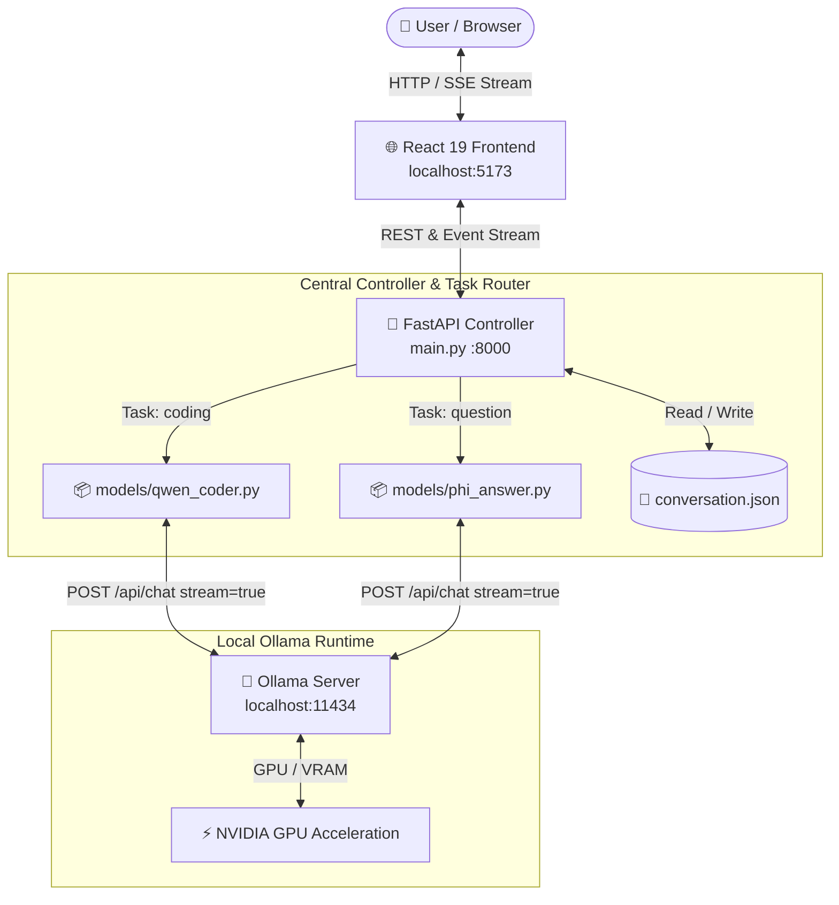

# 🛡️ Sovereign On-Premise Agentic AI Workbench

<div align="center">


**A high-performance, enterprise-grade, localized AI workbench that runs entirely on local hardware.**  
*Zero cloud data egress • Zero third-party telemetry • Air-gapped privacy*

</div>

---

> [!IMPORTANT]
> **100% Sovereign AI Architecture**: All prompt embeddings, code context, and model inferences execute locally via **Ollama** on your GPU/CPU hardware. No cloud APIs or external servers are called.

---

## 🌟 Key Highlights

- 💻 **Coding Specialist**: Integrated with **Qwen2.5-Coder** for code synthesis, refactoring, and debugging.
- 💬 **General Q&A Reasoning**: Integrated with **Phi-4 Mini** for fast analytical synthesis and technical Q&A.
- ⚡ **Live Execution Pipeline**: Real-time SSE status visualizer (`Query Received` ➔ `Task Selected` ➔ `Ollama Connected` ➔ `Streaming Response`).
- ⏱️ **Response Timing Metrics**: Millisecond-accurate execution timer measuring backend overhead and local GPU generation speeds.
- 🧠 **Persistent Conversation Memory**: Local JSON storage (`conversation.json`) maintaining multi-turn context.
- 🎨 **Industrial Enterprise UI**: Modern dark-mode interface with monospace code blocks, line numbers, and one-click copy buttons.
- 📡 **Server-Sent Events (SSE)**: Real-time token streaming direct from local model layers.

---

## 🏗️ System Architecture



---

## 📂 Project Structure

```text
SIH/
│
├── main.py                   # Central FastAPI Controller & Task Router
├── requirements.txt          # Python dependencies
├── conversation.json         # Single-user local conversation memory
├── README.md                 # Documentation
│
├── models/                   # Modular Model Handlers Package
│   ├── __init__.py           # Package exports
│   ├── qwen_coder.py         # Qwen2.5-Coder Ollama streaming handler
│   └── phi_answer.py         # Phi-4-mini Ollama streaming handler
│
└── frontend/                 # React 19 + Vite Frontend Workspace
    ├── package.json          # Node dependencies
    ├── vite.config.js        # Vite build configuration
    │
    └── src/
        ├── App.jsx           # Main application state & SSE stream reader
        ├── index.css         # Dark enterprise design system & variables
        ├── App.css           # Grid layouts, pipeline animations & styling
        └── components/
            ├── ExecutionPipeline.jsx # Real-time execution status tracker
            ├── ChatWindow.jsx        # Workspace header & message viewport
            ├── ChatMessage.jsx       # User/AI bubbles & code block renderer
            ├── MessageInput.jsx      # Text input area with Enter listener
            ├── ModelSelector.jsx     # Task toggles ([Coding] | [Question])
            ├── ModelStatus.jsx       # Status badge (Ready/Loading/Generating)
            ├── Sidebar.jsx           # Live Available Models list & metrics
            └── Icons.jsx             # SVG icon components library
```

---

## 📊 Supported Models Matrix

| Task Category | Recommended Model | Model ID | Runtime | Target Use Case | Status |
| :--- | :--- | :--- | :--- | :--- | :---: |
| **Coding** | **Qwen2.5-Coder** | `qwen2.5-coder` | Ollama | Python, JS, C++, SQL generation & debugging | `Active` |
| **Question / General** | **Phi-4 Mini** | `phi4-mini` | Ollama | Technical Q&A, reasoning, and synthesis | `Active` |
| **Document Analysis** | *Enterprise OCR/RAG* | `coming-soon` | Local Vector Store | PDF extraction & document search | `Placeholder` |
| **Vision / Multimodal** | *Visual LLM* | `coming-soon` | Local Vision Engine | Image analysis & visual inspection | `Placeholder` |

---

## ⚡ Live Execution Pipeline & Metrics

When a query is dispatched, the **ExecutionPipeline** widget renders real-time backend stage transitions:

```text
⚡ Local Execution Pipeline
 ├── ✓ Query received
 ├── ✓ Request sent to backend
 ├── ✓ Task identified: Coding
 ├── ✓ Model selected: Qwen2.5-Coder
 ├── ✓ Connected to local Ollama API
 ├── ◉ Qwen2.5-Coder is processing locally...
 ├── ◉ Receiving streamed tokens...
 └── ✓ Response complete (Completed in 4.82s)
```

> [!TIP]
> Upon completion, the pipeline collapses into a compact summary badge:  
> `✓ Generated locally • Qwen2.5-Coder • Completed in 4.82s`

---

## ⚙️ Prerequisites & System Requirements

### Hardware Requirements
- **NVIDIA GPU**: Recommended (e.g. RTX 3060 / 4060 or higher with **6 GB+ VRAM**).
- **System RAM**: **16 GB+** recommended.
- **Storage**: SSD with at least 10 GB free space for local quantized model weights.

### Software Prerequisites
- **Python**: `3.10+` (Ensure `Add Python to PATH` is enabled)
- **Node.js**: `v18.0.0+` & `npm`
- **Ollama**: Installed and available in PATH
- **NVIDIA Drivers**: Latest drivers with CUDA support

---

## 🚀 Step-by-Step Setup Guide

### Step 1: Install & Verify System Tools

Check tool versions in PowerShell:

```powershell
python --version
node --version
npm --version
ollama --version
nvidia-smi
```

---

### Step 2: Download Local Ollama AI Models

Pull the required models into your local Ollama store:

```powershell
# 1. Download Qwen2.5-Coder for coding tasks
ollama pull qwen2.5-coder

# 2. Download Phi-4 Mini for general Q&A tasks
ollama pull phi4-mini
```

Verify installed models:

```powershell
ollama list
```

---

### Step 3: Set Up Python Virtual Environment & Dependencies

From the project root `D:\New folder\SIH`:

```powershell
# Create virtual environment
python -m venv .venv

# Activate environment (Windows PowerShell)
.venv\Scripts\activate

# Install backend dependencies
pip install -r requirements.txt
```

---

### Step 4: Set Up Frontend Dependencies

From the frontend directory `D:\New folder\SIH\frontend`:

```powershell
cd frontend
npm install
```

---

## 🖥️ Running the Complete Workbench

Launch the system across 3 separate terminal windows:

### Terminal 1: Ollama Server
```powershell
ollama serve
```
*(Runs locally at `http://localhost:11434`)*

### Terminal 2: FastAPI Controller Backend
```powershell
cd "D:\New folder\SIH"
.venv\Scripts\activate
uvicorn main:app --reload --port 8000
```
*(Runs at `http://localhost:8000` • Swagger Docs at `http://localhost:8000/docs`)*

### Terminal 3: React Frontend UI
```powershell
cd "D:\New folder\SIH\frontend"
npm run dev
```
*(Opens dev server at `http://localhost:5173`)*

---

## 🛠️ Useful Commands & GPU Monitoring

### Check Loaded Models & GPU Offloading
```powershell
ollama ps
```
*Example Output:*
```text
NAME                    SIZE      PROCESSOR
qwen2.5-coder:latest    5.1 GB    100% GPU
```

### Real-time NVIDIA GPU Monitoring
```powershell
nvidia-smi -l 1
```
*Monitors GPU VRAM, temperature, and compute utilization every second. Press `Ctrl + C` to exit.*

---

## 🔍 Troubleshooting Guide

| Issue | Cause | Solution |
| :--- | :--- | :--- |
| `503 Service Unavailable` | Ollama server is offline | Run `ollama serve` in terminal. |
| `404 Model Not Found` | Target model not pulled yet | Run `ollama pull qwen2.5-coder` or `ollama pull phi4-mini`. |
| `FastAPI Connection Failed` | Backend server not running | Ensure `uvicorn main:app --reload` is active on port 8000. |
| `Port 8000 in use` | Port conflict | Run `uvicorn main:app --reload --port 8001` and update API URL. |

---

## 🔮 Future Development Roadmap

- [ ] **Automatic Task Detection**: Classify incoming prompts automatically to route between `Qwen2.5-Coder` and `Phi-4 Mini`.
- [ ] **Local RAG Pipeline**: Local vector store indexing (FAISS/Chroma) for querying PDF/txt documentation.
- [ ] **Code Execution Sandbox**: Isolated Docker/Wasm container for testing AI-generated code snippets.
- [ ] **Multi-User Database**: Replace `conversation.json` with SQLite/PostgreSQL supporting user accounts & sessions.
- [ ] **Enterprise Security & Audit**: Local audit logs and fine-grained access control.

---

## 🔒 Sovereign AI Principle

```text
User Input ➔ React UI ➔ FastAPI Controller ➔ Local Ollama ➔ NVIDIA GPU ➔ Response
```

**Zero external API dependencies. 100% Confidential. Fully Sovereign.**