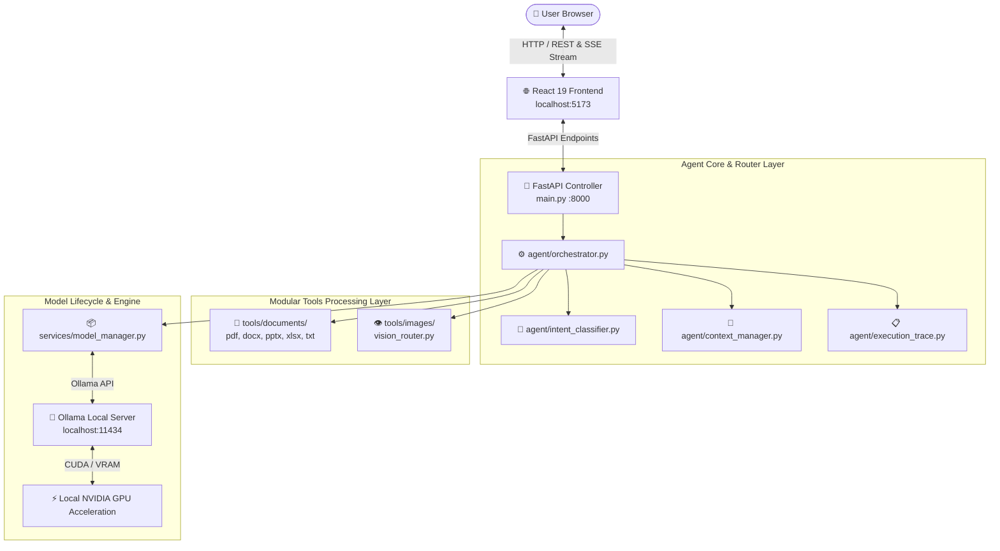

# 🛡️ Sovereign On-Premise Agentic AI Workbench

<div align="center">


**A high-performance, enterprise-grade, localized AI workbench that runs entirely on local hardware.**  
*Zero cloud data egress • Zero third-party telemetry • Air-gapped document & vision processing*

</div>

---

> [!IMPORTANT]
> **100% Sovereign Air-Gapped Architecture**: Prompt embeddings, code execution context, document text extractions, and multimodal vision inferences execute locally via **Ollama** on your GPU/CPU hardware. No external APIs or cloud services are invoked.

---

## 🌟 Key Features

- 💻 **Coding Specialist (`Qwen2.5-Coder`)**: High-speed code synthesis, refactoring, bug fixes, and technical documentation.
- 💬 **General Reasoning (`Phi-4 Mini`)**: Fast analytical reasoning, general synthesis, and structured Q&A.
- 👁️ **Visual Multimodal Analysis (`Qwen2.5-VL-3B`)**: Visual page layout extraction, OCR, image analysis, and document page processing.
- 📄 **Multi-Format Document Processing**: Modular tools for ingesting PDF, DOCX, PPTX, XLSX, CSV, and TXT files with context provenance tracking.
- 🎯 **Intent-Based Dynamic Router**: Classifies **User Intent** (e.g., Document QA vs Coding Task) rather than document content, ensuring accurate model selection.
- ⚙️ **Transparent Agent Execution Trace**: Compact collapsed trace header (`44px`) expanding into a horizontal step timeline with pill badges and click-to-inspect detail modals (`Inspect →`).
- ⚡ **Real-Time Execution Pipeline**: Real-time stage tracker visualizing query reception, document extraction, vision analysis, context window assembly, and token streaming.
- 📎 **Attachment-Aware Conversation Context**: Maintains multi-turn attached document references across follow-up queries.
- 📊 **Telemetry & Loaded Models Monitor**: Real-time CPU, RAM, GPU, and VRAM utilization monitoring with one-click model loading and unloading.
- 🎨 **Enterprise Workbench Interface**: Clean light and dark theme options with custom code block copy headers, line numbers, and formatted lists.

---

## 🏗️ System Architecture



---

## 📂 Project Structure

```text
SIH/
├── main.py                   # Central FastAPI app & endpoints entrypoint
├── requirements.txt          # Python dependencies
├── README.md                 # Complete documentation
│
├── agent/                    # Core Agentic Intelligence Architecture
│   ├── orchestrator.py       # Main request orchestrator & pipeline executor
│   ├── intent_classifier.py  # User intent classifier (Document QA vs Coding)
│   ├── context_manager.py    # Multi-turn conversation state & context window
│   ├── execution_trace.py    # Agent trace logger & step detail collector
│   ├── trace_events.py       # Step event definitions
│   ├── metadata_handler.py   # Attachment metadata extractor
│   └── state.py              # Agent state machine schema
│
├── tools/                    # Non-LLM Processing Tools Architecture
│   ├── documents/            # Document extraction tools
│   │   ├── detector.py       # File extension & MIME type detector
│   │   ├── pdf_processor.py  # PDF page text & structure extractor
│   │   ├── docx_processor.py # DOCX document parser
│   │   ├── pptx_processor.py # Presentation slide parser
│   │   ├── xlsx_processor.py # Spreadsheet & CSV table parser
│   │   ├── text_normalizer.py# Clean text normalization & chunking
│   │   └── document_router.py# Document pipeline router
│   └── images/               # Image & Vision Processing tools
│       ├── image_processor.py# Image loader & byte preparer
│       └── vision_router.py  # Qwen2.5-VL-3B local vision inference
│
├── services/                 # Lifecycle & System Services
│   ├── model_manager.py      # Ollama model loader, unloader & VRAM monitor
│   └── document_service.py   # High-level document ingestion service
│
├── uploads/                  # Local storage for attached files
└── frontend/                 # React 19 + Vite Frontend Workspace
    ├── package.json          # Node packages & build scripts
    ├── vite.config.js        # Vite dev server configuration
    └── src/
        ├── App.jsx           # Master layout & API event state management
        ├── App.css           # Workspace styling & design system
        ├── index.css         # Typography, HSL color tokens & resets
        └── components/
            ├── AgentTrace.jsx        # Compact trace bar & horizontal timeline
            ├── ExecutionPipeline.jsx # Real-time pipeline status tracker
            ├── ChatWindow.jsx        # Top header & message viewport
            ├── ChatMessage.jsx       # Assistant cards & document pipeline UI
            ├── MessageInput.jsx      # Input composer & attachment preview card
            ├── ModelSelector.jsx     # Manual model selector dropdown
            ├── LoadedModels.jsx      # Loaded models & unload controls
            ├── SystemResources.jsx   # Live CPU/RAM/GPU telemetry bars
            ├── Sidebar.jsx           # Session history, search & GPU node info
            └── Icons.jsx             # SVG icon component library
```

---

## 📊 Supported Local AI Models Matrix

| Task Category | Recommended Model | Model ID | Engine | Primary Function |
| :--- | :--- | :--- | :--- | :--- |
| **General Q&A** | **Phi-4 Mini** | `phi4-mini` | Ollama | Fast analytical reasoning, synthesis, and Q&A |
| **Coding & Tech** | **Qwen2.5-Coder** | `qwen2.5-coder` | Ollama | Python, JS, C++, SQL generation & debugging |
| **Vision & Layout** | **Qwen2.5-VL-3B** | `qwen2.5vl:3b` | Ollama | Visual page layout analysis, OCR & image inspection |

---

## ⚡ Agent Execution Trace & Pipeline

### Collapsed Trace State (Default)
```text
┌──────────────────────────────────────────────────────────────────┐
│ ⚙ Agent Execution Trace    6 Steps • Completed in 13.66s        ˅│
└──────────────────────────────────────────────────────────────────┘
```

### Expanded Horizontal Step Timeline
```text
┌──────────────────────────────────────────────────────────────────┐
│ ⚙ Agent Execution Trace                          6 Steps        │
│                                                                  │
│ [✓ Query Received] → [✓ Attachment Resolved] → [✓ Document QA]   │
│ 0.00s               0.01s                      0.42s             │
│                                                                  │
│ Sources Used                                                     │
│ [attachment_resolver] [document_processor] [user_input]         │
│                                                                  │
│ Final Generator: Phi-4 Mini                Completed in 13.66s   │
└──────────────────────────────────────────────────────────────────┘
```

---

## ⚙️ Requirements & Prerequisites

### Minimum Hardware
- **NVIDIA GPU**: Recommended **6 GB+ VRAM** (e.g. RTX 3050 / 3060 / 4060).
- **System RAM**: **16 GB+** recommended.
- **Disk Space**: 15 GB free space for local model weights.

### Software Requirements
- **Python**: `3.10+`
- **Node.js**: `v18.0.0+` & `npm`
- **Ollama**: Installed and added to system PATH
- **NVIDIA Drivers**: Installed with CUDA support

---

## 🚀 Quickstart Guide

### 1. Download Local Ollama Models

Pull the required models in terminal:

```powershell
# 1. General Reasoning Model
ollama pull phi4-mini

# 2. Coding Specialist Model
ollama pull qwen2.5-coder

# 3. Vision Multimodal Model
ollama pull qwen2.5vl:3b
```

---

### 2. Install Backend Dependencies

From the project root directory:

```powershell
# Create & activate Python virtual environment
python -m venv .venv
.venv\Scripts\activate

# Install backend dependencies
pip install -r requirements.txt
```

---

### 3. Install Frontend Dependencies

From the `frontend` directory:

```powershell
cd frontend
npm install
```

---

## 🖥️ Running the Application

Launch the 3 core processes:

### Terminal 1: Ollama Engine
```powershell
ollama serve
```

### Terminal 2: FastAPI Backend Server
```powershell
.venv\Scripts\activate
python main.py
```
*(Runs backend at `http://localhost:8000` • API docs at `http://localhost:8000/docs`)*

### Terminal 3: Vite React Frontend
```powershell
cd frontend
npm run dev
```
*(Access web application UI at `http://localhost:5173`)*

---

## 🔒 Confidentiality & Air-Gapped Security Guarantee

```text
User Input ➔ React UI ➔ Local FastAPI ➔ Ollama Service ➔ NVIDIA GPU ➔ Response
```

- **Zero Cloud Egress**: All prompt tokens, document text, and image pixels remain strictly on local compute hardware.
- **Zero Third-Party Telemetry**: No analytics or tracking scripts are loaded or executed.